Are you a CS2109S TA (Teaching Assistant) conducting multiple tutorials a week? Are you having troubles with keeping track of student attendance and participation scores during tutorials?

Introducing nerdTrackerPlus, your ultimate companion in managing student details and tracking their progress effortlessly!

nerdTrackerPlus is a **desktop app** specifically designed for **CS2109S tutors**. It helps you manage student details and progress for your tutorials. nerdTrackerPlus is optimized for use via a **Command Line Interface** (CLI) while still having the benefits of a Graphical User Interface (GUI). If you can type fast, nerdTrackerPlus can get your student management tasks done faster than traditional GUI apps.

nerdTrackerPlus contains several key features to address these issues such as `markp` and `marka` commands to help you keep track of participation scores and attendance, as well as `adda` to add custom assignments to students!

---

## Table of Contents

- Table of Contents
{:toc}

---

## Quick start

1. Ensure you have Java `11` or above installed in your Computer.

1. Download the latest `nerdTrackerPlus.jar` from [here](https://github.com/AY2324S2-CS2103T-F11-1/tp/releases).

1. Copy the file to the folder you want to use as the _home folder_ for your nerdTrackerPlus.

1. Open a command terminal, `cd` into the folder you put the jar file in, and use the `java -jar nerdTrackerPlus.jar` command to run the application. 
   A GUI similar to the below should appear in a few seconds. Note how the app contains some sample data. 
   

1. Type the command in the command box and press Enter to execute it. e.g. typing **`help`** and pressing Enter will open the help window. 
   Some example commands you can try:

   * `list` : Lists all students.

   * `add n/John Doe m/A1234567A e/e1234567@u.nus.edu tl/johnthedoe` : Adds a student named `John Doe` to nerdTrackerPlus.

   * `delete 3` : Deletes the 3rd student shown in the current list.

   * `clear` : Deletes all students.

   * `exit` : Exits the app.

1. Refer to the [Features](#features) below for details of each command.

---

## Features

**:information_source: Notes about the command format:** 

* Words in `UPPER_CASE` are the parameters to be supplied by the user. 
  e.g. in `add n/NAME`, `NAME` is a parameter which can be used as `add n/John Doe`.

* Items in square brackets are optional. 
  e.g `n/NAME [t/TAG]` can be used as `n/John Doe t/friend` or as `n/John Doe`.

* Items with `…`​ after them can be used multiple times including zero times (unless otherwise stated). 
  e.g. `[t/TAG]…​` can be used as ` ` (i.e. 0 times), `t/friend`, `t/friend t/family` etc.

* Parameters can be in any order. 
  e.g. if the command specifies `n/NAME p/PHONE_NUMBER`, `p/PHONE_NUMBER n/NAME` is also acceptable.

* For commands that require `INDEX`, it must be specified before parameters.  
  e.g. `edit n/Adam 1` is incorrect while `edit 1 n/Adam` is correct.

* Extraneous parameters for commands that do not take in parameters (such as `help`, `list`, `exit` and `clear`) will be ignored. 
  e.g. if the command specifies `help 123`, it will be interpreted as `help`.

* If you are using a PDF version of this document, be careful when copying and pasting commands that span multiple lines as space characters surrounding line-breaks may be omitted when copied over to the application.

### General commands

#### Viewing help : `help`

Shows you a message explaining how to access the help page.

<h4>Format:</h4>

`help`

#### Undoing a previous command : `undo`

Undoes the previous command you executed that changed data.

<h4>Format:</h4>

`undo`

<h4>Notes:</h4>

* Only undoes a command if it has changed data in nerdTrackerPlus since launch.
* Will not undo if no commands were issued beforehand.

<h4>Example:</h4>

* `marka 1 3` to mark the attendance of student 1 in week 3, followed by `undo`

<h4>Potential errors:</h4>

| Error encountered                                               | How to resolve                                                                     |
|:----------------------------------------------------------------|:-----------------------------------------------------------------------------------|
| Unknown command                                                 | Ensure that the command word provided is correct.                                  |
| Unable to undo since there were no previously issued commands.  | Ensure that at least 1 command was previously used before using the undo command.  |

#### Redoing a previously undone command : `redo`

Redoes the previous command that you undid.

<h4>Format:</h4>

`redo`

<h4>Notes:</h4>

* Redo command must be issued immediately after an undo command.
* Will only redo the command that was undone immediately prior.
* Will not redo if no commands were undone beforehand.
* Maximum number of redo commands issued cannot be greater than the number of undo command issued.   e.g. If only 2 undo commands were issued, only a maximum of 2 redo commands can be used.

<h4>Example:</h4>

* `marka 1 3` to mark the attendance of student 1 in week 3, followed by `undo`, then `redo`

<h4>Potential errors:</h4>

| Error encountered                                              | How to resolve                                                                      |
|:---------------------------------------------------------------|:------------------------------------------------------------------------------------|
| Unknown command                                                | Ensure that the command word provided is correct.                                   |
| Unable to redo since there were no previously issued commands. | Ensure that at least 1 command was previously undone before using the redo command. |

#### Clearing all entries : `clear`

Clears all your student entries from nerdTrackerPlus.

<h4>Format:</h4>

`clear`

<h4>Example:</h4>

* `clear`

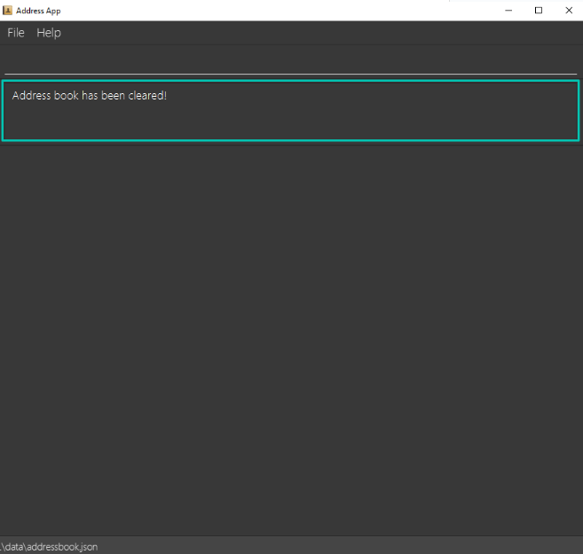

#### Exiting the program : `exit`

Exits the program.

<h4>Format:</h4>

`exit`

<h4>Example:</h4>

* `exit`

### Managing students

#### Adding a student : `add`

Adds a student from your tutorial class to nerdTrackerPlus.

<h4>Format:</h4>

`add n/NAME m/MATRIC_NUMBER e/EMAIL tl/TELEGRAM_HANDLE [t/TAG]…​`

:bulb: **Tip:**
A student can have any number of tags (including 0)

<h4>Fields:</h4>

|       Field       | Prefix |                    Required                     | Requirements                                                                                                      |
|:-----------------:|:------:|:-----------------------------------------------:|:------------------------------------------------------------------------------------------------------------------|
|      `NAME`       |  `n/`  |  | Name of the student. It should only contain alphanumeric characters and spaces.                                   |
|  `MATRIC_NUMBER`  |  `m/`  |  | Matriculation number of the student. It should start and end with a capital letter and have 7 digits in between.  |
|      `EMAIL`      |  `e/`  |  | Email of the student. Email should match the format: `<local>@<domain>.<label>`.                                  |
| `TELEGRAM_HANDLE` | `tl/`  |  | Telegram username of the student. It should only contain alphanumeric characters.                                 |
|       `TAG`       |  `t/`  |   | Tag(s) for the student. It should only contain alphanumeric characters and spaces. Tags specified must be unique. |

<h4>Notes:</h4>
* A student is uniquely identified by their `NAME`. This field is case-sensitive.
* You may add multiple tags to a student by specifying the `t/` prefix multiple times.
* If 2 identical tags are specified (e.g. t/tag1 t/tag1), only 1 tag will be added.

<h4>Example:</h4>

* `add n/John Doe m/A1234567Z e/johnd@u.nus.edu tl/johndoe01 t/cs2109s`  

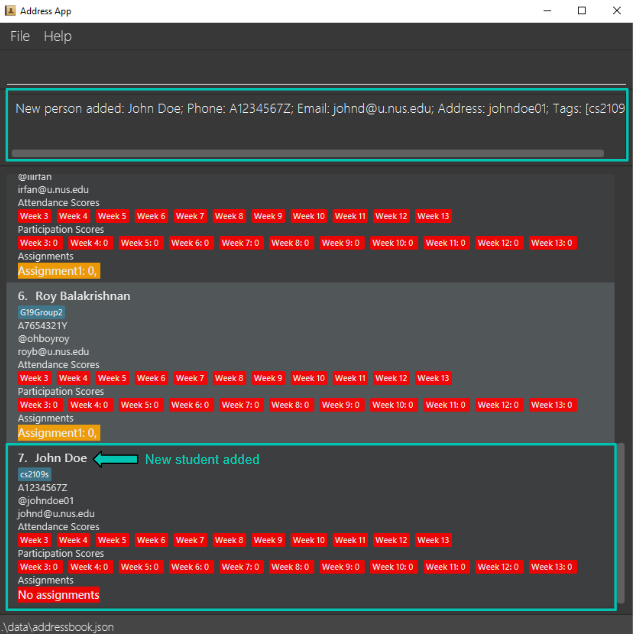

<h4>Potential errors:</h4>

| Error encountered                                                                            | How to resolve                                                                                 |
|:---------------------------------------------------------------------------------------------|:-----------------------------------------------------------------------------------------------|
| Unknown command                                                                              | Ensure that the command word provided is correct.                                              |
| Invalid command format                                                                       | Ensure that all required fields are provided.                                                  |
| Names should only contain alphanumeric characters and spaces, and it should not be blank     | Ensure that the name does not include any special characters.                                  |
| Emails should be of the format local-part@domain and adhere to the following constraints:... | Ensure that the email follows the correct format specified                                     |
| Matric numbers should begin and end with capital letters, and comprise 7 digits in between.  | Ensure that the matric number is in the correct format.                                        |
| Telegram Handle should be alphanumeric without whitespaces                                   | Ensure that the telegram handle does not contain any whitespaces or special characters.        |
| Tags names should be alphanumeric                                                            | Ensure that the tags does not contain any special characters or whitespaces.                   |
| This person already exists in the address book                                               | Ensure that the name of the new student to be added does not already exist in nerdTrackerPlus. |
| Multiple values specified for the following single-valued field(s)                           | Ensure that there are no duplicates for single valued fields.                                  |

#### Listing all students : `list`

Shows you a list of all students in nerdTrackerPlus.

<h4>Format:</h4>

`list`

<h4>Example:</h4>

* `list`

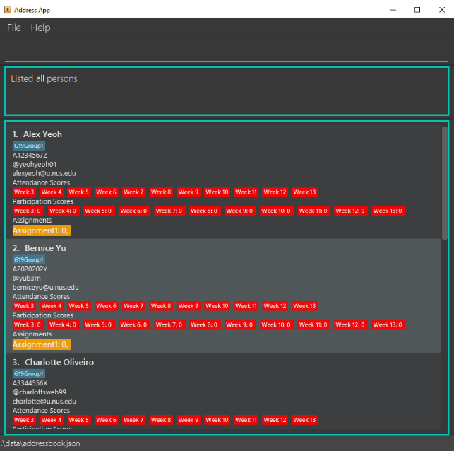

#### Editing a student : `edit`

Edits your students' details in nerdTrackerPlus.

<h4>Format:</h4>

`edit INDEX [n/NAME] [m/MATRIC_NUMBER] [e/EMAIL] [tl/TELEGRAM_HANDLE] [t/TAG]…​`

<h4>Fields:</h4>

|       Field       |                     Prefix                      |                    Required                     | Requirements                                                                                                             |
|:-----------------:|:-----------------------------------------------:|:-----------------------------------------------:|:-------------------------------------------------------------------------------------------------------------------------|
|      `INDEX`      |   |  | `INDEX` **must be a positive integer** 1, 2, 3 …​  `INDEX` cannot be greater than the number of students in the list. |
|      `NAME`       |                      `n/`                       |   | Name of the student. It should only contain alphanumeric characters and spaces.                                          |
|  `MATRIC_NUMBER`  |                      `m/`                       |   | Matriculation number of the student. It should start and end with a capital letter and have 7 digits in between.         |
|      `EMAIL`      |                      `e/`                       |   | Email of the student. Email should match the format: `<local>@<domain>.<label>`.                                         |
| `TELEGRAM_HANDLE` |                      `tl/`                      |   | Telegram username of the student. It should only contain alphanumeric characters.                                        |
|       `TAG`       |                      `t/`                       |   | Tag(s) for the student. It should only contain alphanumeric characters and spaces.                                       |

<h4>Notes:</h4>

* Edits the student at the specified `INDEX`. The index refers to the index number shown in the displayed student list.
* `INDEX` **must** be specified before the other parameters.
* At least one of the optional fields must be provided.
* Existing values will be updated to the input values.
* When editing tags, the existing tags of the student will be removed i.e adding of tags is not cumulative.
* You can remove all the student’s tags by typing `t/` without specifying any tags after it.

<h4>Example:</h4>

*  `edit 1 n/Alex Lim tl/alexlim01` Edits the name and telegram handle of the first student to be `Alex Lim` and `alexlim01` respectively.

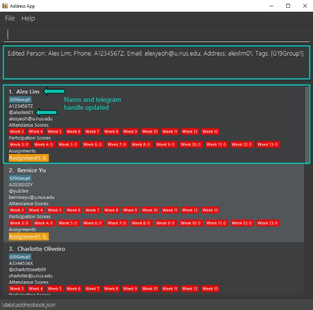

<h4>Potential errors:</h4>

| Error encountered                                                                            | How to resolve                                                                                 |
|:---------------------------------------------------------------------------------------------|:-----------------------------------------------------------------------------------------------|
| Unknown command                                                                              | Ensure that the command word provided is correct.                                              |
| Invalid command format                                                                       | Ensure that all required fields are provided.                                                  |
| At least one field to edit must be provided.                                                 | Ensure that at least 1 field to edit is specified.                                             |
| The person index provided is invalid                                                         | Ensure that the index provided is not greater than the number of students in the list.         |
| Names should only contain alphanumeric characters and spaces, and it should not be blank     | Ensure that the name does not include any special characters.                                  |
| Emails should be of the format local-part@domain and adhere to the following constraints:... | Ensure that the email follows the correct format specified                                     |
| Matric numbers should begin and end with capital letters, and comprise 7 digits in between.  | Ensure that the matric number is in the correct format.                                        |
| Telegram Handle should be alphanumeric without whitespaces                                   | Ensure that the telegram handle does not contain any whitespaces or special characters.        |
| Tags names should be alphanumeric                                                            | Ensure that the tags does not contain any special characters or whitespaces.                   |
| This person already exists in the address book                                               | Ensure that the name of the new student to be added does not already exist in nerdTrackerPlus. |
| Multiple values specified for the following single-valued field(s)                           | Ensure that there are no duplicates for single valued fields.                                  |

#### Locating students by name : `find`

Finds students whose names contain any of the given keywords.

<h4>Format:</h4>

`find KEYWORD [MORE_KEYWORDS]`

<h4>Fields:</h4>

|      Field       |                     Prefix                     |                     Required                     | Requirements |
|:----------------:|:----------------------------------------------:|:------------------------------------------------:|:-------------|
|    `KEYWORD`     |  |   | NIL          |
| `MORE_KEYWORDS`  |  |    | NIL          |

<h4>Notes:</h4>

* The search is case-insensitive. e.g `hans` will match `Hans`
* The order of the keywords does not matter. e.g. `Hans Bo` will match `Bo Hans`
* Only the name is searched.
* Only full words will be matched e.g. `Han` will not match `Hans`
* students matching at least one keyword will be returned (i.e. `OR` search).
  e.g. `Hans Bo` will return `Hans Gruber`, `Bo Yang`

<h4>Example:</h4>

* `find alex charlotte` returns `Alex Yeoh` and `Charlotte Oliveiro`

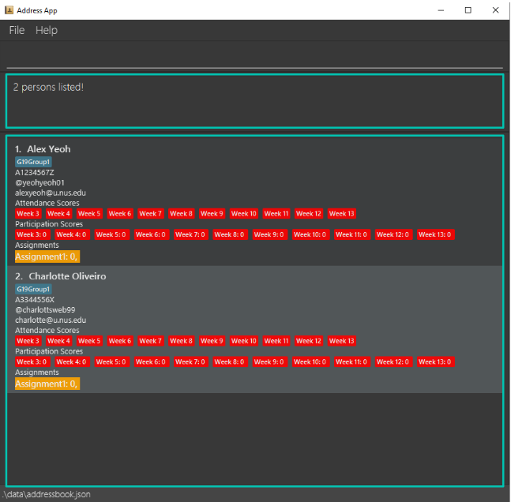

<h4>Potential error:</h4>

| Error encountered | How to resolve                                    |
|:------------------|:--------------------------------------------------|
| Unknown command   | Ensure that the command word provided is correct. |

#### Deleting a student : `delete`

Deletes a student from your student list nerdTrackerPlus.

<h4>Format</h4>

`delete INDEX`

<h4>Fields:</h4>

|      Field      |                     Prefix                      |                     Required                     | Requirements                                                                                                             |
|:---------------:|:-----------------------------------------------:|:------------------------------------------------:|:-------------------------------------------------------------------------------------------------------------------------|
|     `INDEX`     |   |   | `INDEX` **must be a positive integer** 1, 2, 3 …​  `INDEX` cannot be greater than the number of students in the list. |

<h4>Notes:</h4>

* Deletes the student at the specified `INDEX`.
* The index refers to the index number shown in the displayed student list.

<h4>Example:</h4>

* `list` followed by `delete 1` deletes the 1st student, Alex Yeoh, in nerdTrackerPlus.

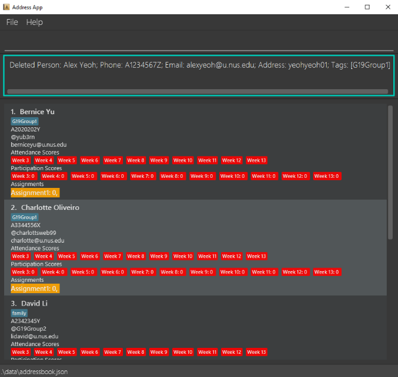

<h4>Potential errors:</h4>

| Error encountered                     | How to resolve                                                                          |
|:--------------------------------------|:----------------------------------------------------------------------------------------|
| Unknown command                       | Ensure that the command word provided is correct.                                       |
| Invalid command format                | Ensure that all required fields are provided.                                           |
| The person index provided is invalid  | Ensure that the index provided is not greater than the number of students in the list.  |

#### Remove tag from a student : `removetag`

Deletes the specified tag from a student in nerdTrackerPlus.

<h4>Format:</h4>

`removetag INDEX t/TAG…`

<h4>Fields:</h4>

|  Field  |                     Prefix                     |                    Required                     | Requirements                                                                                                                              |
|:-------:|:----------------------------------------------:|:-----------------------------------------------:|:------------------------------------------------------------------------------------------------------------------------------------------|
| `INDEX` |  |  | `INDEX` **must be a positive integer** 1, 2, 3 …​  `INDEX` cannot be greater than the number of students in the list.                  |
|  `TAG`  |                      `t/`                      |  | It should only contain alphanumeric characters. Tag must exist on the student. At least 1 or more tags must be specified.                 |

* Removes tags of the student at the specified `INDEX`.
* The index refers to the index number shown in the displayed student list.
* `TAG` is case-sensitive.

<h4>Example:</h4>

* `list` followed by `removetag 1 t/G19Group1` removes the G19Group1 tag from the 1st student in nerdTrackerPlus.

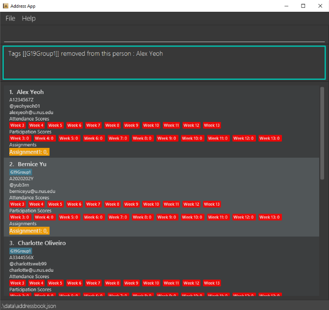

<h4>Potential errors:</h4>

| Error encountered                        | How to resolve                                                                         |
|:-----------------------------------------|:---------------------------------------------------------------------------------------|
| Unknown command                          | Ensure that the command word provided is correct.                                      |
| Invalid command format                   | Ensure that all required fields are provided.                                          |
| Index is not a non-zero unsigned integer | Ensure that the index provided is a positive integer.                                  |
| The person index provided is invalid     | Ensure that the index provided is not greater than the number of students in the list. |
| This person does not have that tag       | Ensure that the person specified at the index contains the tag.                        |
| Tags names should be alphanumeric        | Ensure that the tags does not contain any special characters or whitespaces.           |

####  Remove tag(s) from all students : `removetagall`

Deletes the specified tag(s) from all students that have the tag(s).

<h4>Format:</h4>

`removetagall t/TAG(S)…​`

<h4>Fields:</h4>

|  Field   | Prefix |                    Required                     | Requirements                                                                                                      |
|:--------:|:------:|:-----------------------------------------------:|:------------------------------------------------------------------------------------------------------------------|
| `TAG(S)` |  `t/`  |  | Tag on a student. It should only contain alphanumeric characters. Tag must exist on at least 1 student.           |

<h4>Notes:</h4>

* More than 1 tag can be specified to be removed.

<h4>Example:</h4>
`removetagall t/G19Group1` removes the G19Group1 tag from the first 3 students in the list.

<h4>Potential errors:</h4>

| Error encountered                  | How to resolve                                                               |
|:-----------------------------------|:-----------------------------------------------------------------------------|
| Unknown command                    | Ensure that the command word provided is correct.                            |
| Invalid command format             | Ensure that all required fields are provided.                                |
| No persons have any of the tag(s)  | Ensure that at least 1 person has the tag specified.                         |
| Tags names should be alphanumeric  | Ensure that the tags does not contain any special characters or whitespaces. |

#### Filtering by tags : `filter`

Filters all students from your list of students in nerdTrackerPlus with the specified tags.

<h4>Format</h4>

`filter TAG…​`

<h4>Fields:</h4>

| Field  |                     Prefix                     |                     Required                     | Requirements                                     |
|:------:|:----------------------------------------------:|:------------------------------------------------:|:-------------------------------------------------|
| `TAG`  |  |   | Tag should only contain alphanumeric characters. |

<h4>Notes:</h4>

* If `filter` is used and more than 1 tag is used to filter, students that match any one of the tags will be shown.
* Tags are case-insensitive. e.g. `cs2109s` will match `CS2109S`

<h4>Example:</h4>
* `filter family`

<h4>Potential errors:</h4>

| Error encountered                  | How to resolve                                                               |
|:-----------------------------------|:-----------------------------------------------------------------------------|
| Unknown command                    | Ensure that the command word provided is correct.                            |
| Invalid command format             | Ensure that all required fields are provided.                                |

### Managing participation, attendance and assignments

#### Marking individual participation scores : `markp`

Marks the participation score of a specific student from your tutorial class.

<h4>Format:</h4>

`markp INDEX WEEK_NUMBER`

<h4>Fields:</h4>

|     Field     |                     Prefix                     |                      Required                      | Requirements                                                                                                          |
|:-------------:|:----------------------------------------------:|:--------------------------------------------------:|:----------------------------------------------------------------------------------------------------------------------|
|    `INDEX`    |  |     | INDEX **must be a positive integer** 1, 2, 3 …​   INDEX cannot be greater than the number of students in the list. |
| `WEEK_NUMBER` |  |     | WEEK_NUMBER **must be a valid week from the range [3, 13]**.                                                          |

<h4>Notes:</h4>

* Marks the participation score of the student at the specified `INDEX` in the specified `WEEK_NUMBER`
* The `INDEX` refers to the index number shown in the displayed student list.

<h4>Example:</h4>

* `markp 1 3` marks the participation score of Alex Yeoh in week 3.

<h4>Potential errors:</h4>

| Error encountered                     | How to resolve                                                                          |
|:--------------------------------------|:----------------------------------------------------------------------------------------|
| Unknown command                       | Ensure that the command word provided is correct.                                       |
| Invalid command format                | Ensure that all required fields are provided.                                           |
| The person index provided is invalid  | Ensure that the index provided is not greater than the number of students in the list.  |
| The week provided is invalid          | Ensure that the week number is in the range [3, 13] inclusive.                          |

#### Un-marking individual participation scores : `unmarkp`

Un-marks the participation score of a specific student from your tutorial class.

<h4>Format:</h4>

`unmarkp INDEX WEEK_NUMBER`

<h4>Fields:</h4>

|     Field     |                     Prefix                     |                    Required                     | Requirements                                                                                                          |
|:-------------:|:----------------------------------------------:|:-----------------------------------------------:|:----------------------------------------------------------------------------------------------------------------------|
|    `INDEX`    |  |  | INDEX **must be a positive integer** 1, 2, 3 …​   INDEX cannot be greater than the number of students in the list. |
| `WEEK_NUMBER` |  |  | WEEK_NUMBER **must be a valid week from the range [3, 13]**.                                                          |

<h4>Notes:</h4>

* Un-marks the participation score of the student at the specified `INDEX` in the specified `WEEK_NUMBER`
* The `INDEX` refers to the index number shown in the displayed student list.

<h4>Example:</h4>

* `markp 1 3` followed by `unmarkp 1 3`

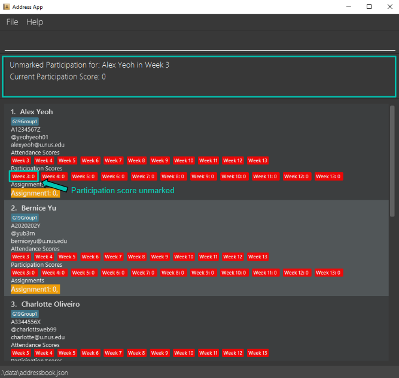

<h4>Potential errors:</h4>

| Error encountered                                                     | How to resolve                                                                                |
|:----------------------------------------------------------------------|:----------------------------------------------------------------------------------------------|
| Unknown command                                                       | Ensure that the command word provided is correct.                                             |
| Invalid command format                                                | Ensure that all required fields are provided.                                                 |
| The person index provided is invalid                                  | Ensure that the index provided is not greater than the number of students in the list.        |
| The week provided is invalid                                          | Ensure that the week number is in the range [3, 13] inclusive.                                |
| Participation for `STUDENT_NAME` in Week `WEEK_NUMBER` is already 0   | Ensure that all students in the currently filtered list have at least 1 participation score.  |

#### Marking individual attendance scores : `marka`

Marks the attendance of a specific student from your tutorial class.

<h4>Format:</h4>

`marka INDEX WEEK_NUMBER`

<h4>Fields:</h4>

|     Field     |                     Prefix                      |                    Required                     | Requirements                                                                                                          |
|:-------------:|:-----------------------------------------------:|:-----------------------------------------------:|:----------------------------------------------------------------------------------------------------------------------|
|    `INDEX`    |   |  | INDEX **must be a positive integer** 1, 2, 3 …​   INDEX cannot be greater than the number of students in the list. |
| `WEEK_NUMBER` |   |  | WEEK_NUMBER **must be a valid week from the range [3, 13]**.                                                          |

<h4>Notes:</h4>

* Marks the attendance of the student at the specified `INDEX` in the specified `WEEK_NUMBER`
* The `INDEX` refers to the index number shown in the displayed student list.

<h4>Example:</h4>

* `marka 1 3` marks the attendance of Alex Yeoh in week 3.

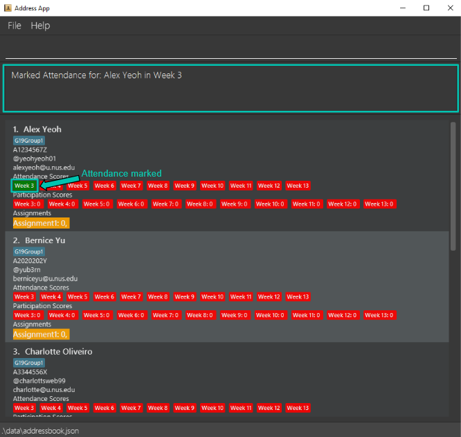

<h4>Potential errors:</h4>

| Error encountered                     | How to resolve                                                                          |
|:--------------------------------------|:----------------------------------------------------------------------------------------|
| Unknown command                       | Ensure that the command word provided is correct.                                       |
| Invalid command format                | Ensure that all required fields are provided.                                           |
| The person index provided is invalid  | Ensure that the index provided is not greater than the number of students in the list.  |
| The week provided is invalid          | Ensure that the week number is in the range [3, 13] inclusive.                          |

#### Un-marking individual attendance scores : `unmarka`

Un-marks the attendance of a specific student from your tutorial class.

<h4>Format:</h4>

`unmarka INDEX WEEK_NUMBER`

<h4>Fields:</h4>

|     Field     |                     Prefix                      |                    Required                     | Requirements                                                                                                          |
|:-------------:|:-----------------------------------------------:|:-----------------------------------------------:|:----------------------------------------------------------------------------------------------------------------------|
|    `INDEX`    |   |  | INDEX **must be a positive integer** 1, 2, 3 …​   INDEX cannot be greater than the number of students in the list. |
| `WEEK_NUMBER` |   |  | WEEK_NUMBER **must be a valid week from the range [3, 13]**.                                                          |

<h4>Notes:</h4>

* Un-marks the attendance of the student at the specified `INDEX` in the specified `WEEK_NUMBER`
* The `INDEX` refers to the index number shown in the displayed student list.

<h4>Example:</h4>

* `marka 1 3` followed by `unmarka 1 3` unmarks the attendance of Alex Yeoh in week 3.

<h4>Potential errors:</h4>

| Error encountered                     | How to resolve                                                                          |
|:--------------------------------------|:----------------------------------------------------------------------------------------|
| Unknown command                       | Ensure that the command word provided is correct.                                       |
| Invalid command format                | Ensure that all required fields are provided.                                           |
| The person index provided is invalid  | Ensure that the index provided is not greater than the number of students in the list.  |
| The week provided is invalid          | Ensure that the week number is in the range [3, 13] inclusive.                          |

#### Marking all participation scores : `markallp`

Marks the participation scores of all students in the filtered list for a given week.

<h4>Format:</h4>

`markallp WEEK_NUMBER`

<h4>Fields:</h4>

|     Field     |                     Prefix                     |                    Required                     | Requirements                                                 |
|:-------------:|:----------------------------------------------:|:-----------------------------------------------:|:-------------------------------------------------------------|
| `WEEK_NUMBER` |  |  | WEEK_NUMBER **must be a valid week from the range [3, 13]**. |

<h4>Example:</h4>

* `list` followed by `markallp 3` marks all students in the list for week 3.

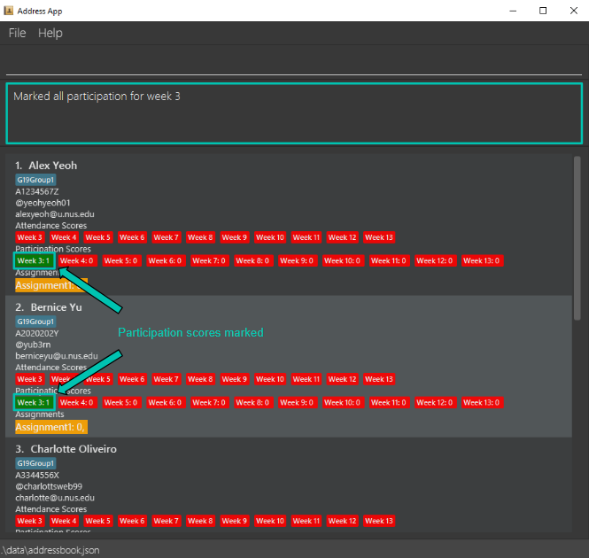

<h4>Potential errors:</h4>

| Error encountered                     | How to resolve                                                                          |
|:--------------------------------------|:----------------------------------------------------------------------------------------|
| Unknown command                       | Ensure that the command word provided is correct.                                       |
| Invalid command format                | Ensure that all required fields are provided.                                           |
| The week provided is invalid          | Ensure that the week number is in the range [3, 13] inclusive.                          |

#### Un-marking all participation scores : `unmarkallp`

Un-marks the participation scores of all students in the filtered list for a given week.

<h4>Format:</h4>

`unmarkallp WEEK_NUMBER`

<h4>Fields:</h4>

|     Field     |                     Prefix                     |                    Required                     | Requirements                                                 |
|:-------------:|:----------------------------------------------:|:-----------------------------------------------:|:-------------------------------------------------------------|
| `WEEK_NUMBER` |  |  | WEEK_NUMBER **must be a valid week from the range [3, 13]**. |

<h4>Notes:</h4>

* If 1 or more students has participation score `0`, the `unmarkallp` command will not proceed, and will not un-mark all other students' participation scores even if they have scores greater than `0`.

<h4>Example:</h4>

* `markallp 3` followed by `unmarkallp 3` unmarks the participation score of all students in week 3.

<h4>Potential errors:</h4>

| Error encountered                                                    | How to resolve                                                                               |
|:---------------------------------------------------------------------|:---------------------------------------------------------------------------------------------|
| Unknown command                                                      | Ensure that the command word provided is correct.                                            |
| Invalid command format                                               | Ensure that all required fields are provided.                                                |
| The week provided is invalid                                         | Ensure that the week number is in the range [3, 13] inclusive.                               |
| Participation for `STUDENT_NAME` in Week `WEEK_NUMBER` is already 0  | Ensure that all students in the currently filtered list have at least 1 participation score. |

#### Marking all attendance scores : `markalla`

Marks the attendance of all students in the filtered list for a given week.

<h4>Format:</h4>

`markalla WEEK_NUMBER`

<h4>Fields:</h4>

|     Field     |                     Prefix                      |                    Required                     | Requirements                                                 |
|:-------------:|:-----------------------------------------------:|:-----------------------------------------------:|:-------------------------------------------------------------|
| `WEEK_NUMBER` |   |  | WEEK_NUMBER **must be a valid week from the range [3, 13]**. |

<h4>Example:</h4>

* `list` followed by `markalla 3` marks the attendance all students in week 3.

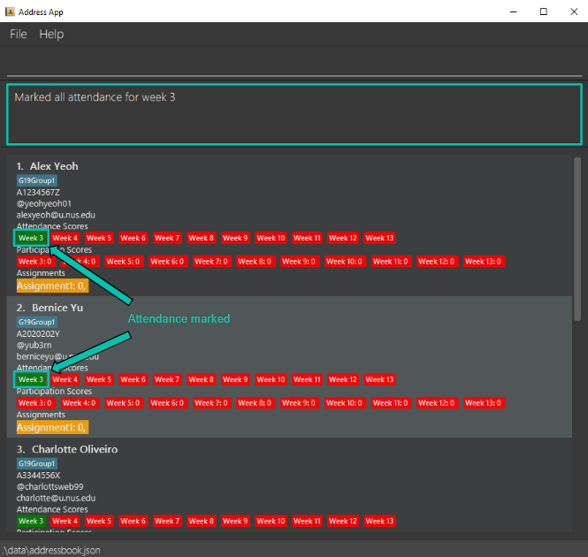

<h4>Potential errors:</h4>

| Error encountered                     | How to resolve                                                                          |
|:--------------------------------------|:----------------------------------------------------------------------------------------|
| Unknown command                       | Ensure that the command word provided is correct.                                       |
| Invalid command format                | Ensure that all required fields are provided.                                           |
| The week provided is invalid          | Ensure that the week number is in the range [3, 13] inclusive.                          |

#### Un-marking all attendance scores : `unmarkalla`

Un-marks the attendance of all students in the filtered list for a given week.

<h4>Format:</h4>

`unmarkalla WEEK_NUMBER`

<h4>Fields:</h4>

|     Field     |                     Prefix                      |                     Required                     | Requirements                                                 |
|:-------------:|:-----------------------------------------------:|:------------------------------------------------:|:-------------------------------------------------------------|
| `WEEK_NUMBER` |   |   | WEEK_NUMBER **must be a valid week from the range [3, 13]**. |

<h4>Notes:</h4>

* If 1 or more students has attendance score `0`, the `unmarkalla` command will not proceed, and will not un-mark all other students' attendance scores even if they have scores greater than `0`.

<h4>Example:</h4>

* `markalla 3` followed by `unmarkalla 3` un-marks the attendance of all students in week 3.

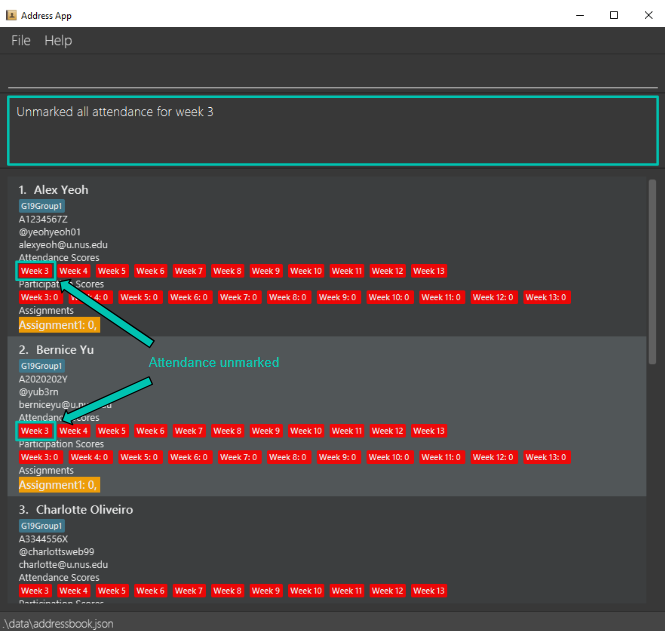

<h4>Potential errors:</h4>

| Error encountered                     | How to resolve                                                                          |
|:--------------------------------------|:----------------------------------------------------------------------------------------|
| Unknown command                       | Ensure that the command word provided is correct.                                       |
| Invalid command format                | Ensure that all required fields are provided.                                           |
| The week provided is invalid          | Ensure that the week number is in the range [3, 13] inclusive.                          |

#### Adding a custom assignment : `adda`

Adds assignment(s) to all students in your filtered list if they do not already exist.

<h4>Format:</h4>

`adda a/ASSIGNMENT…​`

<h4>Fields:</h4>

|      Field      | Prefix |                     Required                     | Requirements                                                          |
|:---------------:|:------:|:------------------------------------------------:|:----------------------------------------------------------------------|
| `ASSIGNMENT...` |   a/   |   | Assignment(s) should only contain alphanumeric characters.            |

<h4>Notes:</h4>

* Each assignment is case-sensitive e.g. `a/assignment1` and `a/Assignment1` are 2 different assignments.
* Duplicate assignments will be ignored e.g. If `a/assignment1` and `a/assignment1` are specified, only 1 assignment is added.

<h4>Example:</h4>

* `adda a/assignment1 a/assignment2`

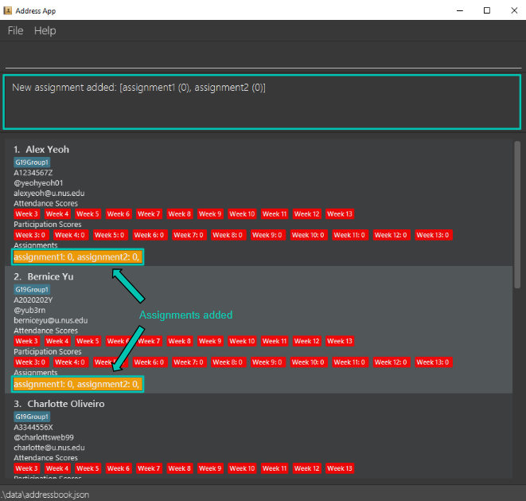

| Error encountered                                                                 | How to resolve                                                                                                    |
|:----------------------------------------------------------------------------------|:------------------------------------------------------------------------------------------------------------------|
| Unknown command                                                                   | Ensure that the command word provided is correct.                                                                 |
| Invalid command format                                                            | Ensure that all required fields are provided.                                                                     |
| Assignment names should be alphanumeric                                           | Ensure that assignment names contain only alphanumeric characters.                                                |
| No new assignments added. All students already have the assignment(s) specified.  | Ensure that the new assignment to be added does not currently exist on **ALL** the students in the filtered list. |

#### Removing a custom assignment : `removea`

Removes assignment(s) from all students in your filtered list if they have them.

<h4>Format:</h4>

`removea a/ASSIGNMENT…`

<h4>Fields:</h4>

|     Field     | Prefix |                     Required                     | Requirements                                                                                                       |
|:-------------:|:------:|:------------------------------------------------:|:-------------------------------------------------------------------------------------------------------------------|
| `ASSIGNMENT…` |   a/   |   | Assignment(s) should only contain alphanumeric characters. At least 1 assignment specified must exist on students. |

<h4>Notes:</h4>

* Each assignment is case-sensitive e.g. `a/assignment1` and `a/Assignment1` are 2 different assignments.

<h4>Example:</h4>

* `adda a/assignment1 a/assignment2` followed by `removea a/assignment1 a/assignment2`

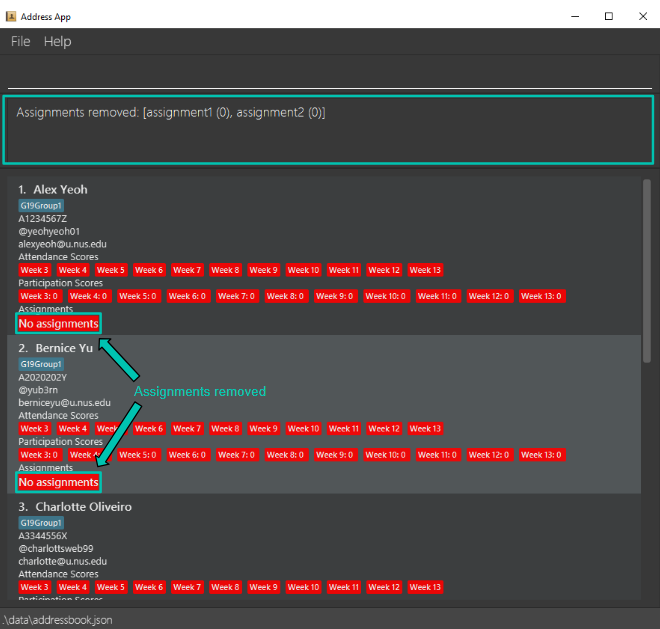

<h4>Potential errors:</h4>

| Error encountered                                                      | How to resolve                                                     |
|:-----------------------------------------------------------------------|:-------------------------------------------------------------------|
| Unknown command                                                        | Ensure that the command word provided is correct.                  |
| Invalid command format                                                 | Ensure that all required fields are provided.                      |
| Assignment names should be alphanumeric                                | Ensure that assignment names contain only alphanumeric characters. |
| No assignments removed. No students have the assignment(s) specified.  | Ensure that the assigment specified exist on at least 1 student.   |

#### Grading a custom assignment : `grade`

Grades and assigns a score to an assignment for a given student in your tutorial class.

<h4>Format:</h4>

`grade INDEX SCORE a/ASSIGNMENT`

<h4>Fields:</h4>

|    Field     |                     Prefix                      |                     Required                     | Requirements                                                                                                          |
|:------------:|:-----------------------------------------------:|:------------------------------------------------:|:----------------------------------------------------------------------------------------------------------------------|
|   `INDEX`    |   |   | INDEX **must be a positive integer** 1, 2, 3 …​   INDEX cannot be greater than the number of students in the list. |
|   `SCORE`    |   |   | SCORE **must be a non-negative integer** 0, 1, 2 …​                                                                   |
| `ASSIGNMENT` |                       a/                        |   | Assignment should only contain alphanumeric characters. Assignment must exist on the specified student.               |

<h4>Notes:</h4>

* The fields INDEX and SCORE **must** precede before the ASSIGNMENT.  e.g. `grade a/assignment1 1 100` is incorrect while `grade 1 100 a/assignment1` is correct.
<h4>Example:</h4>

* `grade 1 100 a/assignment1`

<h4>Potential errors:</h4>

| Error encountered                              | How to resolve                                                                                            |
|:-----------------------------------------------|:----------------------------------------------------------------------------------------------------------|
| Unknown command                                | Ensure that the command word provided is correct.                                                         |
| Invalid command format                         | Ensure that all required fields are provided.                                                             |
| Invalid arguments provided for Grade Command.  | Ensure that the score provided is an integer between the range [0, MAX_INT], where MAX_INT is 2147483647. |
| Index is not a non-zero unsigned integer.      | Ensure that the index provided is a positive integer.                                                     |
| The person index provided is invalid           | Ensure that the index provided is not greater than the number of students in the list.                    |
| The week provided is invalid                   | Ensure that the week number is in the range [3, 13] inclusive.                                            |

## Saving the data

nerdTrackerPlus data is saved in the hard disk automatically after any command that changes the data. There is no need to save manually.

## Editing the data file

nerdTrackerPlus data are saved automatically as a JSON file `[JAR file location]/data/addressbook.json`. Advanced users are welcome to update data directly by editing that data file.

:exclamation: **Caution:**
If your changes to the data file makes its format invalid, nerdTrackerPlus will discard all data and start with an empty data file at the next run. Hence, it is recommended to take a backup of the file before editing it. 
Furthermore, certain edits can cause the nerdTrackerPlus to behave in unexpected ways (e.g., if a value entered is outside the acceptable range). Therefore, edit the data file only if you are confident that you can update it correctly.

---

## FAQ

**Q**: How do I transfer my data to another Computer? 
**A**: Install the app in the other computer and overwrite the empty data file it creates with the file that contains the data of your previous nerdTrackerPlus home folder.

---

## Glossary

### Participation

A grading criteria to evaluate CS2109S students based on their active involvement during tutorials. It quantifies how frequently a student voluntarily contributes answers or engages in discussions.

### Attendance

A grading criteria to evaluate CS2109s students based on their presence during tutorials. It quantifies students' punctuality and regularity in attending tutorials.

### Integers

A whole number in the range -2147483647 to 2147483647 that does not contain any fractions or decimals.

### MAX_INT / MIN_INT

The maximum / minimum value that can be represented with an integer.  
For signed integers, MAX_INT = 2147483647 while MIN_INT = -2147483647.

## Known issues

1. **When using multiple screens**, if you move the application to a secondary screen, and later switch to using only the primary screen, the GUI will open off-screen. The remedy is to delete the `preferences.json` file created by the application before running the application again.

---

## Command summary

### Managing students

| Action                                                                       | Format                                                                           | Example                                                     |
|:-----------------------------------------------------------------------------|:---------------------------------------------------------------------------------|:------------------------------------------------------------|
| [Add student](#adding-a-student--add)                                        | `add n/NAME m/MATRIC_NUMBER e/EMAIL tl/TELEGRAM_HANDLE [t/TAG]…​`                | `add n/John Doe m/A1234567Z e/johnd@u.nus.edu tl/johndoe01` |
| [List students](#listing-all-students--list)                                 | `list`                                                                           | `list`                                                      |
| [Edit student](#editing-a-student--edit)                                     | `edit INDEX [n/NAME] [m/MATRIC_NUMBER] [e/EMAIL] [tl/TELEGRAM_HANDLE] [t/TAG]…​` | `edit 1 m/A1111111Z e/johndoe@gmail.com`                    |
| [Find student](#locating-students-by-name--find)                             | `find KEYWORD [MORE_KEYWORDS]`                                                   | `find alex david`                                           |
| [Delete student](#deleting-a-student--delete)                                | `delete INDEX`                                                                   | `delete 2`                                                  |
| [Remove tag from student](#remove-tag-from-a-student--removetag)             | `removetag INDEX [t/TAG]…`                                                       | `removetag 2 t/friend`                                      |
| [Remove tag from all students](#remove-tags-from-all-students--removetagall) | `removetagall TAG…​`                                                             | `removetagall t/G19Group1 t/family`                         |
| [Filter student](#filtering-by-tags--filter)                                 | `filter TAG…​`                                                                   | `filter G19Group1 G19Group2`                                |

### Managing participation, attendance and assignments

| Action                                                                                  | Format                           | Example                               |
|:----------------------------------------------------------------------------------------|:---------------------------------|:--------------------------------------|
| [Mark individual participation](#marking-individual-participation-scores--markp)        | `markp INDEX WEEK_NUMBER`        | `markp 1 3`                           |
| [Unmark individual participation](#un-marking-individual-participation-scores--unmarkp) | `unmarkp INDEX WEEK_NUMBER`      | `unmarkp 1 3`                         |
| [Mark individual attendance](#marking-individual-attendance-scores--marka)              | `marka INDEX WEEK_NUMBER`        | `marka 1 3`                           |
| [Unmark individual attendance](#un-marking-individual-attendance-scores--unmarka)       | `unmarka INDEX WEEK_NUMBER`      | `unmarka 1 3`                         |
| [Mark all participation](#marking-all-participation-scores--markallp)                   | `markallp WEEK_NUMBER`           | `markallp 3`                          |
| [Unmark all participation](#un-marking-all-participation-scores--unmarkallp)            | `unmarkallp WEEK_NUMBER`         | `unmarkallp 3`                        |
| [Mark all attendance](#marking-all-attendance-scores--markalla)                         | `markalla WEEK_NUMBER`           | `markalla 3`                          |
| [Unmark all attendance](#un-marking-all-attendance-scores--unmarkalla)                  | `unmarkalla WEEK_NUMBER`         | `unmarkalla 3`                        |
| [Add assignment](#adding-a-custom-assignment--adda)                                     | `adda a/ASSIGNMENT…​`            | `adda a/assignment1 a/assignment2`    |
| [Remove assignment](#removing-a-custom-assignment--removea)                             | `removea a/ASSIGNMENT…​`         | `removea a/assignment1 a/assignment2` |
| [Grade assignment](#grading-a-custom-assignment--grade)                                 | `grade INDEX SCORE a/ASSIGNMENT` | `grade 1 100 a/assignment1`           |

### General

| Action                                             | Format   | Example |
|:---------------------------------------------------|:---------|:--------|
| [View Help](#viewing-help--help)                   | `help`   | `help`  |
| [Undo](#undoing-a-previous-command--undo)          | `undo`   | `undo`  |
| [Redo](#redoing-a-previously-undone-command--redo) | `redo`   | `redo`  |
| [Clear](#clearing-all-entries--clear)              | `clear`  | `clear` |
| [Exit](#exiting-the-program--exit)                 | `exit`   | `exit`  |
